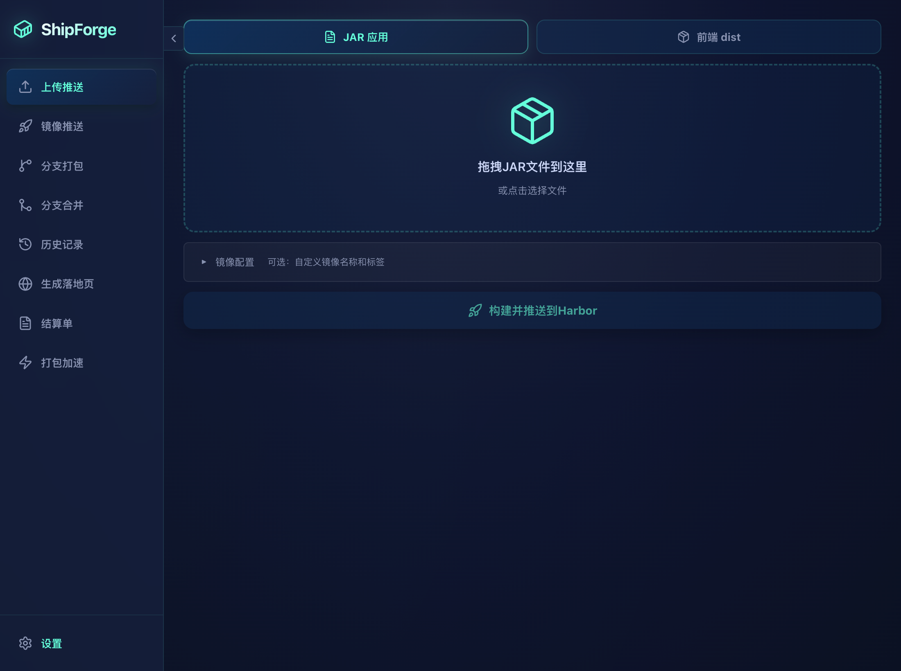
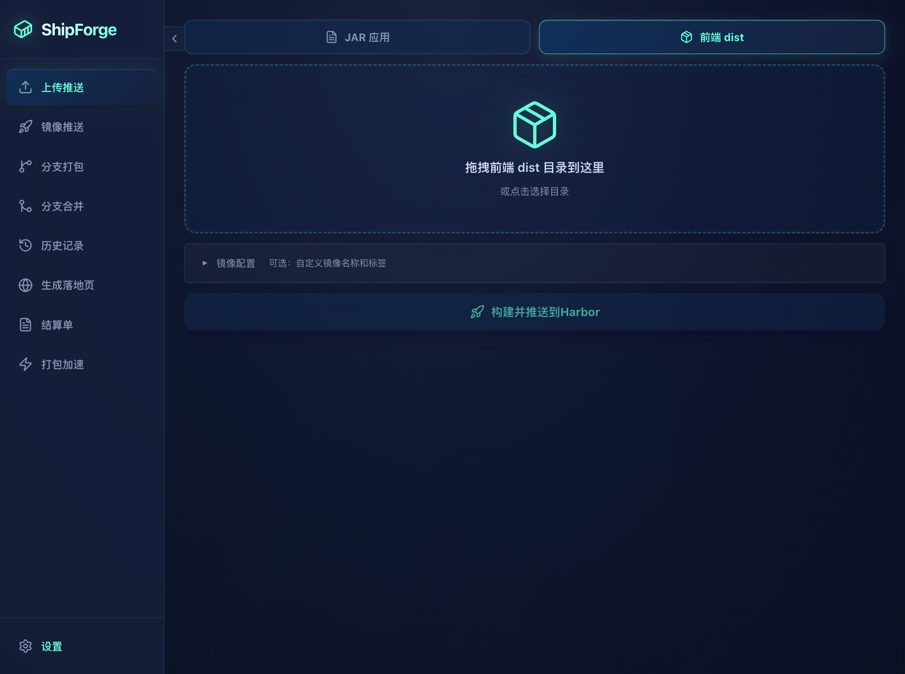
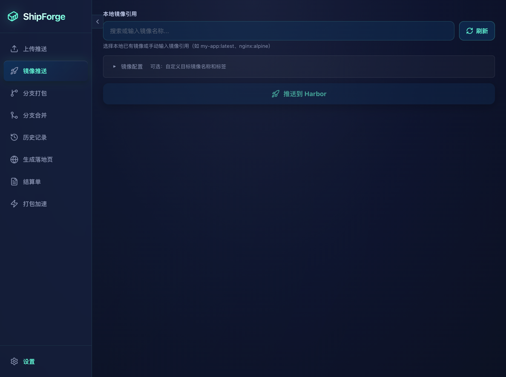
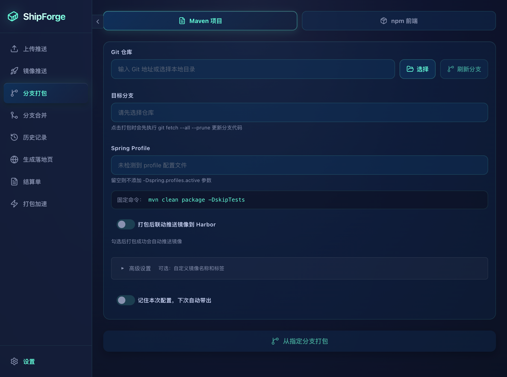
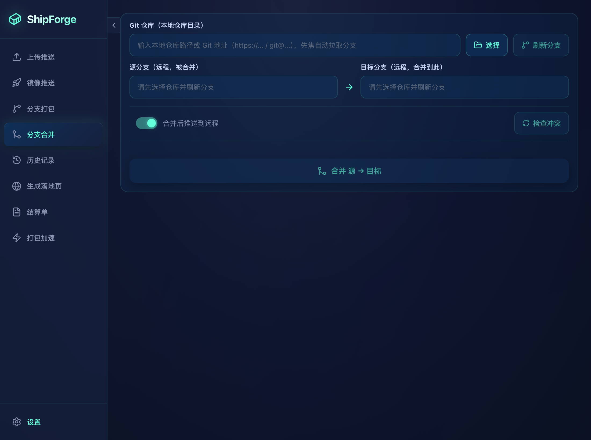
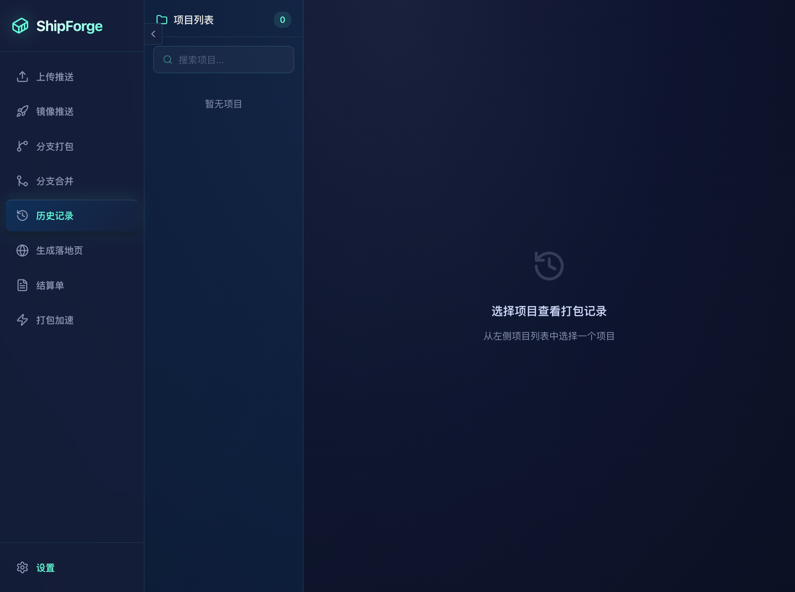
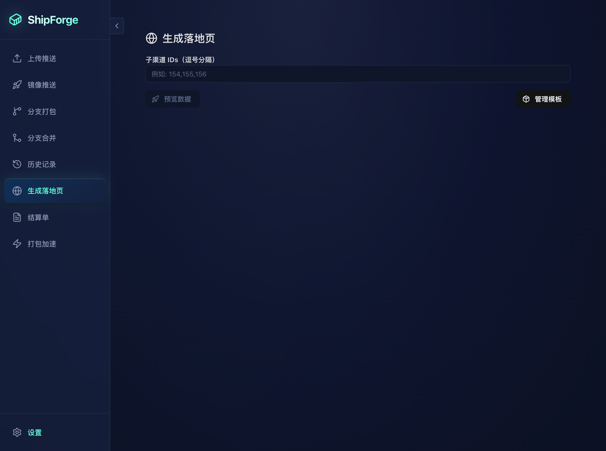
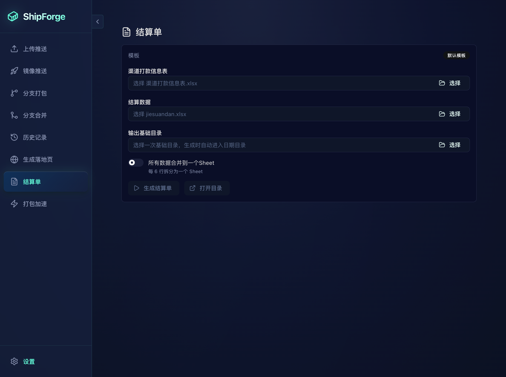
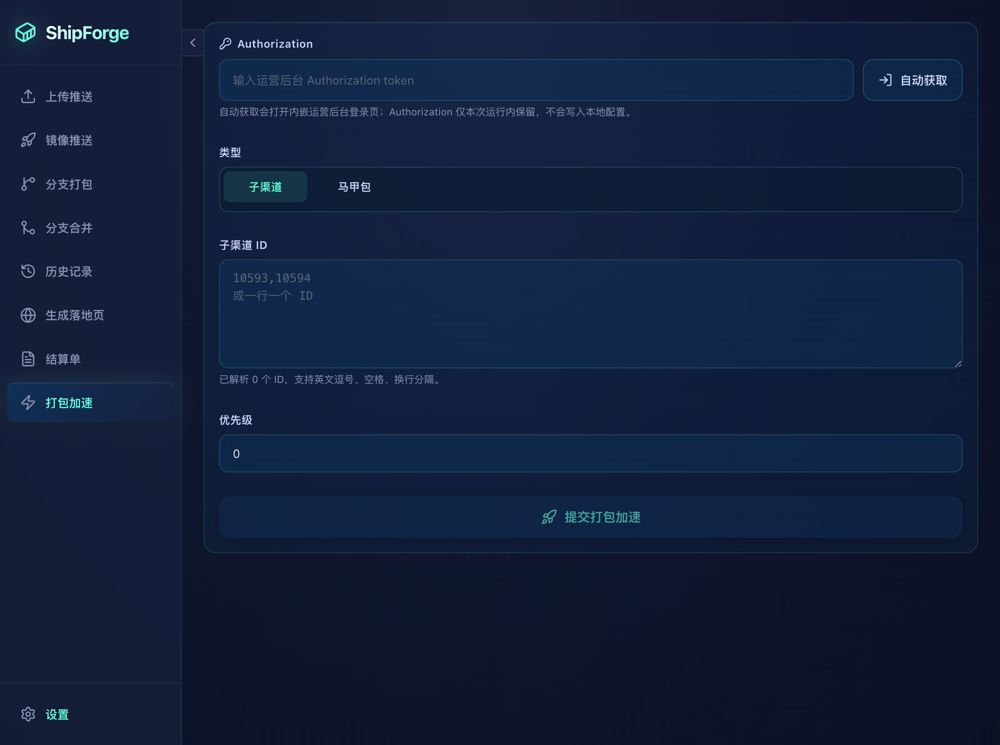
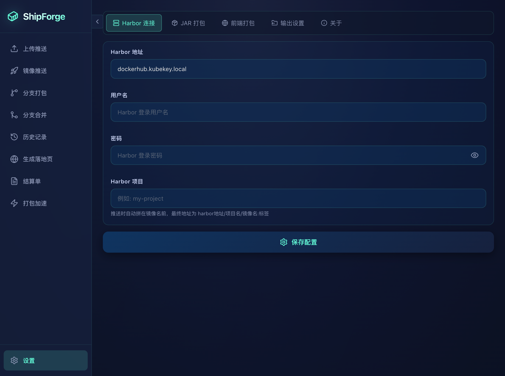

# ShipForge (JarPorter)

Tauri 2.0 桌面应用，将 JAR 包或前端 `dist` 目录打包为 Docker 镜像并推送到 Harbor registry。同时集成分支打包、落地页生成、结算单等运营工具。

## 功能导览



---

### 1. 上传推送

选择 **JAR 应用** 或 **前端 dist**，拖拽文件/目录即可构建镜像并推送 Harbor。

| JAR 应用 | 前端 dist |
|---|---|
|  |  |

- **JAR 应用**：Eclipse Temurin 基础镜像 + 自动生成 Dockerfile，自动解压读取 `application.yml` 推断端口
- **前端 dist**：Nginx 静态站点，目录内容直接拷贝到 `/usr/share/nginx/html/`
- 推送到 Harbor 后自动清理本地镜像
- 展开"镜像配置"可自定义镜像名、标签、暴露端口

---

### 2. 镜像推送



- 列出本地 Docker 镜像，选中后推送到 Harbor
- 支持手动输入远程镜像名覆盖

---

### 3. 分支打包



- 支持**本地仓库路径**和 **Git URL** 两种输入方式
- 基于 `git worktree` 隔离构建，自动清理临时目录
- **Maven 项目**：`mvn clean package -DskipTests`
- **npm 项目**：`npm install && npm run <script>`
- `node_modules` 按 lockfile hash 缓存到 `~/.cache/jarporter/npm-cache/`
- 自动检测 Spring profiles、前端子目录、npm scripts
- 支持前后端分离双构建 + 聚合打包
- 分支名自动转为镜像 tag

---

### 4. 分支合并



- 当前分支 → 目标分支合并
- 支持 merge / rebase 策略

---

### 5. 历史记录



- 所有构建记录（产物类型、镜像名、标签、时间、状态）
- 支持清空历史

---

### 6. 生成落地页



- 按渠道 `typeCode` 匹配模板目录，渲染 `{{NAME}}` / `{{LOGO}}` / `{{DOWNLOAD_URL}}` 占位符
- 内建 HTTP 预览服务器（`127.0.0.1`），iframe 内嵌预览
- 一键 FTP 上传

### 模板变量

| 占位符 | 说明 |
|---|---|
| `{{NAME}}` | 产品名称 |
| `{{LOGO}}` | 产品 Logo URL |
| `{{DOWNLOAD_URL}}` | 下载链接 |

### 模板目录

```
templates/
├── comic/
├── novel/
├── aiChat/
├── videoShortPlay/
├── gameLibraryAds/
└── softwareLibrary/
```

---

### 7. 结算单



- 输入**渠道打款信息表** + **结算数据**两个 Excel
- 按打款账号自动分组，生成 `{姓名}_{账号}_{结算周期}.xlsx`
- 模板包含：对账单标题、渠道明细、金额中文大写、开户行/账号信息
- **可切换每 Sheet 6 行 / 全部合并到一个 Sheet**
- 多线程并行生成，实时进度条

---

### 8. 打包加速



- 批量打包多个分支/仓库，并行执行
- 实时进度追踪

---

### 9. 设置



- Harbor 连接配置（Registry 地址、用户名、密码）
- 配置持久化到 `~/.config/jarporter/config.json`
- 支持 Ops 模式切换

---

## 模板变量（前端 Dockerfile）

前端 Dockerfile 和 nginx.conf 模板支持以下占位符：

| 变量 | 说明 |
|---|---|
| `{{BASE_IMAGE}}` | 前端基础镜像，如 `nginx:alpine` |
| `{{EXPOSE_PORT}}` | 暴露/监听端口 |
| `{{NGINX_CONF_PATH}}` | nginx 配置路径 |
| `{{DIST_DIR}}` | 临时构建上下文中的 dist 目录 |
| `{{IMAGE_NAME}}` | 规范化镜像名 |
| `{{IMAGE_TAG}}` | 最终镜像标签 |
| `{{FULL_IMAGE}}` | 完整 registry 镜像引用 |

## 开发

```bash
# 前端开发 (Vite, port 1420)
pnpm dev

# 完整 Tauri 开发 (前端 + Rust 热重载)
pnpm tauri

# 生产构建
pnpm tauri:build

# 架构构建
pnpm tauri:build:arm64
pnpm tauri:build:x64
pnpm tauri:build:universal

# 发布 (tag + push)
pnpm release
```

## 静态 Web Docker 镜像

```bash
docker build -t jarporter-web:latest .
docker run --rm -p 8080:80 jarporter-web:latest
```

## 技术栈

| 层 | 技术 |
|---|---|
| 桌面框架 | Tauri 2.0 |
| 前端 | React 19 + TypeScript + Vite |
| UI 组件 | Mantine |
| 后端 | Rust |
| Excel | rust_xlsxwriter |
| Docker | bollard (Docker API) |

## 推荐 IDE

- [VS Code](https://code.visualstudio.com/) + [Tauri](https://marketplace.visualstudio.com/items?itemName=tauri-apps.tauri-vscode) + [rust-analyzer](https://marketplace.visualstudio.com/items?itemName=rust-lang.rust-analyzer)
